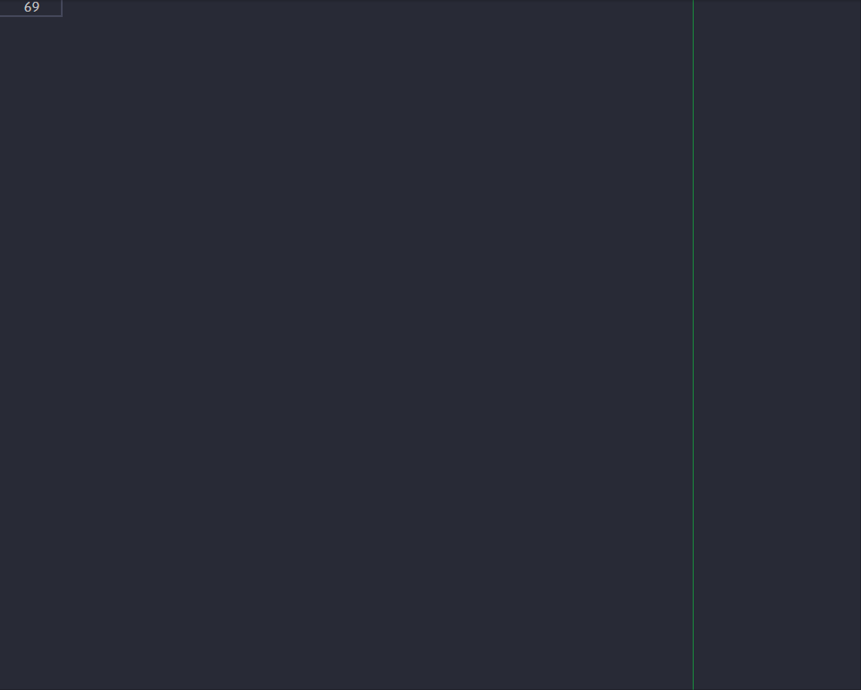

# 🔥 Moodle Main functions snippets 🔥

> Make your life easier as a moodle developer, using the main moodle functionalities snippets for VScode.

  

## Features

> **FORM SNIPPETS**

|      **Snippet**       |                          **Description**                          |
| :--------------------: | :---------------------------------------------------------------: |
| `$mfadd_header, $mfah` |                     Add a moodle form Header.                     |
|  `$mfadd_ele, $mfae`   |                    Add a moodle form element.                     |
|     `$mform, $mf`      | Add a complete moodle form element with type,rule and help button |
|  `$mfadd_btn, $mfab`   |                  Add moodle form action buttons.                  |
| `$mfmulti_sel, $mfams` |            Add a moodle form multi-select input field.            |

> **TABLE SQL SNIPPET**

|    **Snippet**     |             **Description**              |
| :----------------: | :--------------------------------------: |
| `mdl_table, mtsql` | Add a complete moodle table sql skeleton |

> **PAGE SNIPPET**

|    **Snippet**    |        **Description**         |
| :---------------: | :----------------------------: |
| `mdl_page, mpage` | Add a moodle web page skeleton |

> **PLUGIN VERSION SNIPPET**

|      **Snippet**       |           **Description**            |
| :--------------------: | :----------------------------------: |
| `mdl_version, version` | Add a moodle plugin version skeleton |

  

## Release Notes

- **Version 1.0.0**

---

**⭐⭐ Enjoy! ⭐⭐**
